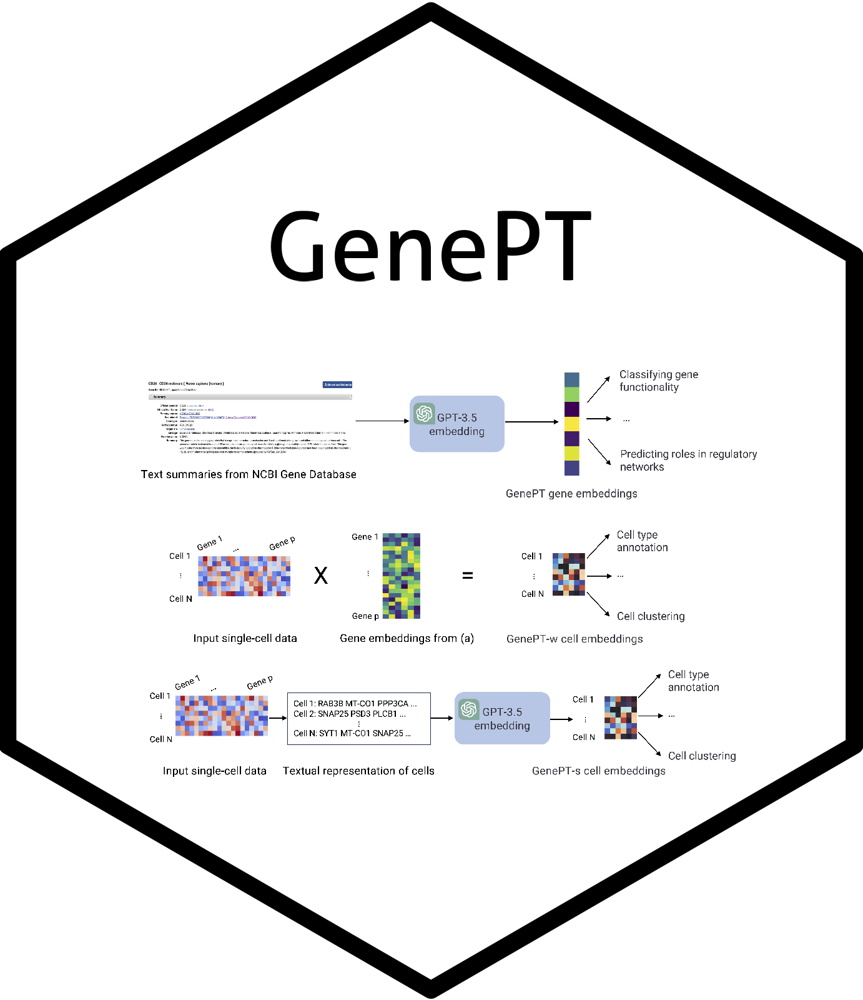

# GenePT  

### What is GenePT?

`GenePT` is a single-cell foundation model that leverages ChatGPT embeddings to tackle gene-level and cell-level biology tasks. This project is motivated by the significant recent progress in using large-scale (e.g., tens of millions of cells) gene expression data to develop foundation models for single-cell biology. These models implicitly learn gene and cellular functions from the gene expression profiles, which requires extensive data curation and resource-intensive training. By contrast, GenePT offers a complementary approach by using NCBI text descriptions of individual genes with GPT-3.5 to generate gene embeddings. From there, GenePT generates single-cell embeddings in two ways: (i) by averaging the gene embeddings, weighted by each gene’s expression level; or (ii) by creating a sentence embedding for each cell, using gene names ordered by the expression level. 

Without the need for dataset curation and additional pretraining, GenePT is efficient and easy to use. On many downstream tasks used to evaluate recent single-cell foundation models --- e.g., classifying gene properties and cell types --- GenePT achieves comparable, and often better, performance than existing single-cell foundation models. GenePT demonstrates that large language model embedding of literature is a simple and effective path for biological foundation models.

### How do I use GenePT?

The analysis scripts used to generate GenePT data and to reproduce the analysis in the paper can be found in the repo (with details for each script in the **Breakdown of analysis files** section below). 

We also provide the following list of readily-available datasets that might be useful for a broader range of applications:
1. Extracted summary texts scraped from the NCBI page for each gene.
2. Pre-computed GPT-3.5 embeddings (`text-embedding-ada-002`) for each gene.
These data are deposited at .

### Tutorials and Use

We provide example notebooks to run the following analyses:
1. Gene-level prediction tasks
2. Gene-gene interaction analysis analysis
3. Cell-level biological data annotation 
4. Batch effect removal (Cardiomyocyte dataset; Aorta dataset)

Please file an [issue](https://github.com/yiqunchen/GenePT/issues) if you have a request for a tutorial that is not currently included.

### Citation

If you use `GenePT` for your analysis, please cite our manuscript:

Chen YT,  Zou J. (2023+) GenePT: A Simple But Hard-to-Beat Foundation Model for Genes and Cells Built From ChatGPT. bioRxiv preprint: https://www.biorxiv.org/content/10.1101/2023.10.16.562533v1.

### Breakdown of analysis files:
1. [request_ncbi_text_for_genes.ipynb](./request_ncbi_text_for_genes.ipynb) provides example code to download NCBI gene summary page.
2. [gene_embeddings_examples.ipynb](./gene_embeddings_examples.ipynb) provides example code to embed the extracted descriptions in 1 using GPT-3.5 embeddings. Note that this requires a valid registration of the OpenAI API (see instructions and pricing details at https://openai.com/blog/openai-api). 
3. [gene_level_task_table_1.ipynb](./gene_level_task_table_1.ipynb) reproduces the gene level tasks for GenePT embeddings in Table 1 of the paper.
4. [gene_level_task_figure_2.ipynb](./gene_level_task_figure_2.ipynb) provides the necessary data and output for the gene level tasks described in Figure 2 of our paper.
5. [aorta_data_analysis.ipynb](./aorta_data_analysis.ipynb) provides example code to create your foundation-model cell embeddings in <20 lines of code and demonstrates the batch effect removal + biology preservation (Figure 4 results of the paper). 

### Datasets used in GenePT
1. For the gene-level tasks, we make use of the following datasets:
	- Geneformer provides the datasets for gene-level tasks reported in Table 1 (https://huggingface.co/datasets/ctheodoris/Genecorpus-30M/tree/main/example_input_files/gene_classification)
	- Gene-gene interaction network datasets were collected as part of the Gene2vec paper, available at https://github.com/jingcheng-du/Gene2vec/tree/master/predictionData.
2. For the cell-level tasks, we make use of the following datasets:
	- hPancreas, Myeloid, and Multiple Sclerosis (processed and distributed by Cui et al. (2023+))
		- Multiple Sclerosis (M.S.) dataset: [link](https://drive.google.com/drive/folders/1Qd42YNabzyr2pWt9xoY4cVMTAxsNBt4v?usp=sharing).
		- Myeloid (Mye.) dataset: [link](https://drive.google.com/drive/folders/1VbpApQufZq8efFGakW3y8QDDpY9MBoDS?usp=drive_link).
		- hPancreas dataset: [link](https://drive.google.com/drive/folders/1s9XjcSiPC-FYV3VeHrEa7SeZetrthQVV?usp=drive_link).
	- Cardiomyocyte dataset: 
		- Original data can be downloaded [here](https://singlecell.broadinstitute.org/single_cell/study/SCP1303/single-nuclei-profiling-of-human-dilated-and-hypertrophic-cardiomyopathy).
		- We created a random 10% subset of the original dataset for our cell-level analysis, available at [this google drive folder](https://drive.google.com/drive/folders/1LgFvJqWNq9BqHbuxB2tYf62kXs9KqL4t?usp=share_link).
	- Aorta dataset:
		- Original data has been deposited [here](https://www.ncbi.nlm.nih.gov/geo/query/acc.cgi?acc=GSE155468), and we used the additional cell type annotation provided by the authors on [GitHub](https://github.com/LI-Yan-Ming/Circulation.-2020-142-1374-1388/blob/main/meta_addsubcluster_cellcycle.csv).
		- We created a 20% random subset of the original dataset ([link](https://drive.google.com/drive/folders/1LgFvJqWNq9BqHbuxB2tYf62kXs9KqL4t?usp=share_link)).

### References:
1. Chaffin, M. et al. Single-nucleus profiling of human dilated and hypertrophic cardiomyopathy. Nature 608, 174–180 (2022).
2. Chen YT,  Zou J. (2023+) GenePT: A Simple But Hard-to-Beat Foundation Model for Genes and Cells Built From ChatGPT. bioRxiv preprint: https://www.biorxiv.org/content/10.1101/2023.10.16.562533v1.
3. Cui, H., et al. (2023). scGPT: Towards building a foundation model for single-cell multi-omics using generative AI. bioRxiv, 2023-04.
4. Li, Y. et al. Single-cell transcriptome analysis reveals dynamic cell populations and differential gene expression patterns in control and aneurysmal human aortic tissue. Circulation 142, 1374–1388 (2020).

